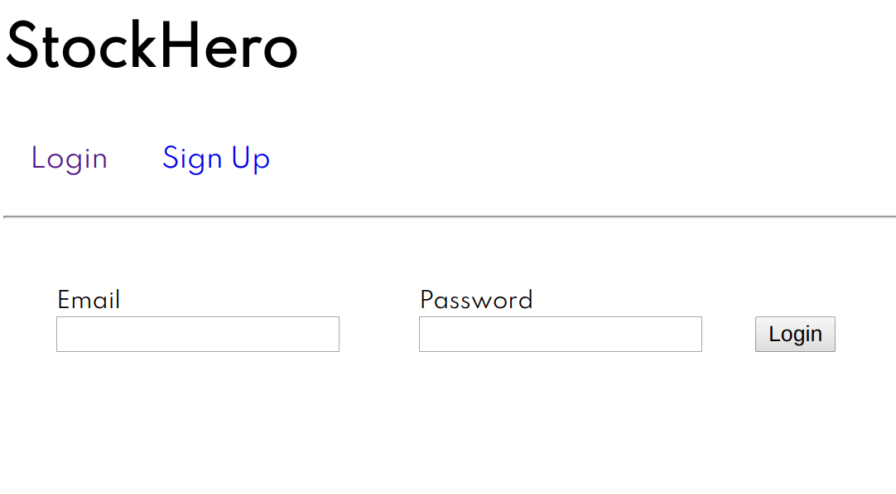
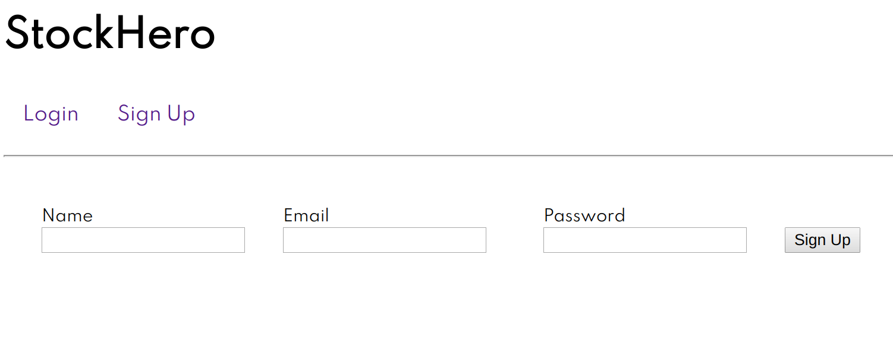
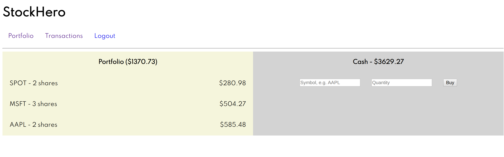
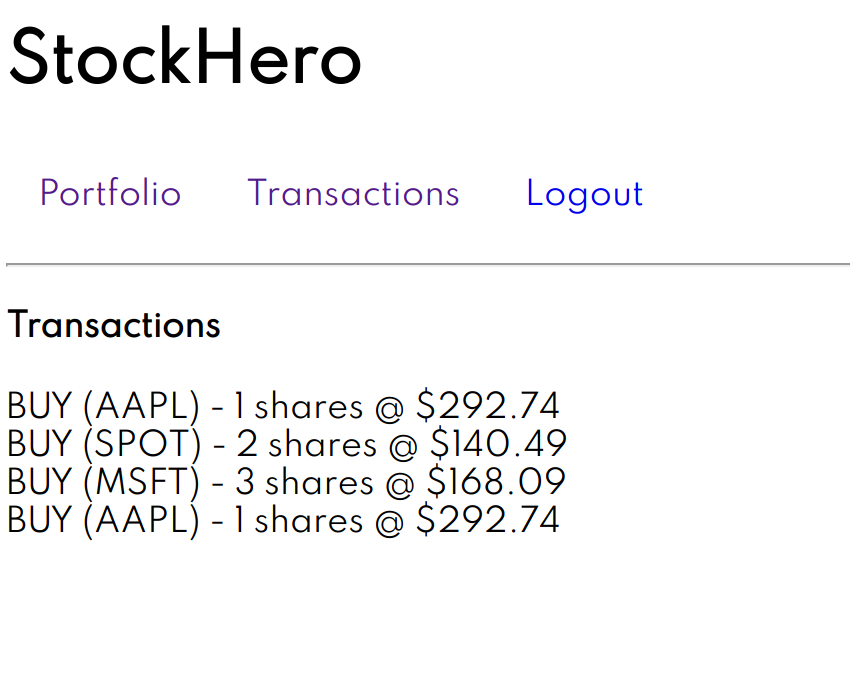

# StockHero

> StockHero is a web app that allows users to sign in/register an account, and buy/trade stocks. Built with Node.js/Express.js/React/PostgreSQL. Deployed link: `https://stockheroapp.herokuapp.com/`

## Login Page:

## Signup Page:

**Once logged in...**

## Portfolio Page:

## Transactions Screen:

